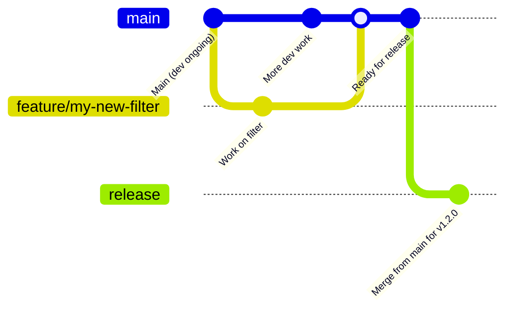
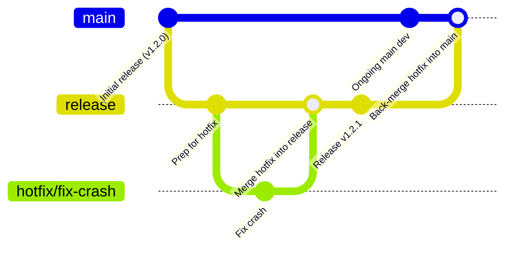

# Contributing to Hugging Face Vision Filter

Thanks for your interest in improving **Hugging Face Vision Filter**, a production-ready OpenFilter component that provides Hugging Face Transformers integration for vision tasks (object detection and image classification) on video streams.

Whether you're adding new model support, improving inference performance, fixing a bug, or refining the docs — your help is appreciated.

This guide walks you through:

* Setting up a local development environment for working on Hugging Face Vision Filter
* Writing and running tests
* Running Hugging Face Vision Filter with the OpenFilter CLI
* Our conventions for PRs and commit formatting
* How to sign your commits (we follow the DCO)
* Where to ask for help or offer ideas

---

## Topics

* [Contributing to Hugging Face Vision Filter](#contributing-to-hugging-face-vision-filter)
  * [Setting up your development environment](#setting-up-your-development-environment)
  * [Running tests](#running-tests)
  * [Running with the OpenFilter CLI](#running-with-the-openfilter-cli)
  * [Reporting issues](#reporting-issues)
  * [Contribution guidelines](#contribution-guidelines)
    * [Pull request process](#pull-request-process)
    * [Commit message format](#commit-message-format)
    * [Sign your commits (DCO)](#sign-your-commits-dco)
  * [Style and conventions](#style-and-conventions)
  * [Release process](#release-process)
  * [Thank you](#thank-you-)

---

## Setting up your development environment

Hugging Face Vision Filter is a standalone Python package that depends on [OpenFilter](https://github.com/PlainsightAI/openfilter).

To get started:

```bash
git clone git@github.com:PlainsightAI/filter-huggingface-vision.git
cd filter-huggingface-vision
python -m venv venv && source venv/bin/activate
make install
```

This installs Hugging Face Vision Filter and its dependencies, including OpenFilter.

### Quick test

You can run Hugging Face Vision Filter directly using:

```python
from filter_huggingface_vision.filter import FilterHuggingfaceVision

if __name__ == "__main__":
    FilterHuggingfaceVision.run()
```

Or include it in a multi-filter pipeline using `Filter.run_multi()`.

---

## Running tests

Hugging Face Vision Filter has a dedicated test suite in `tests/`.

To run just its tests:

```bash
make test
```

If you're editing inference logic, backend handling, or model loading, make sure your changes pass all the test cases.

---

## Running with the OpenFilter CLI

Hugging Face Vision Filter can be used as part of a processing pipeline using the `openfilter` CLI.

Here's an example of running Hugging Face Vision Filter on a video:
```bash
make run
```

This launches:

* `VideoIn` to read the video
* Hugging Face Vision Filter to run inference
* `Webvis` to visualize the output

Make sure the package is installed and discoverable (e.g. via `PYTHONPATH` or proper plugin registration) so the CLI can locate `FilterHuggingfaceVision`.

---

## Reporting issues

Found a bug in how models are loaded? Inference results not behaving as expected?
Please [open an issue](https://github.com/PlainsightAI/filter-huggingface-vision/issues) and include:

* What you were trying to do
* What actually happened
* Example config, input, or stack trace if possible
* Whether it occurs with a specific `detection_type`, model, or edge case

We especially appreciate clear minimal examples or failing tests.

---

## Contribution guidelines

### Pull request process

* Create a feature branch (e.g. `fix-detection-output`, `add-new-backend`)
* Keep changes focused and atomic
* Include or update tests in `tests/` when relevant
* Run `make test` before pushing
* Sign your commits (see below)
* Open your PR against `main`

If your change alters how Hugging Face Vision Filter behaves for legacy config patterns, document that in the PR.

### Commit message format

Use this structure:

```
Short summary (max 50 chars)

Optional detailed explanation with context and rationale.
Reference any related issues using "Closes #123".
```

Use the `-s` flag to sign your commit (see next section).

---

### Sign your commits (DCO)

All commits must be signed using the **Developer Certificate of Origin (DCO)**.

```bash
git commit -s -m "Fix detection output format"
```

The `-s` adds a sign-off line like:

```
Signed-off-by: Your Name <your.email@example.com>
```

Unsigned commits will fail CI.

For more info: [developercertificate.org](https://developercertificate.org)

---

## Style and conventions

* Code is formatted with `black`
* Linting is enforced using `flake8`
* Use type hints on public methods (especially `process()` and `normalize_config()`)
* Use comments to explain non-obvious logic
* Keep logic explicit and testable — avoid overly abstract patterns

### Docstrings

Document:

* Config options in `FilterHuggingfaceVisionConfig`
* Key logic in `process()` related to inference and output formatting
* Behavior for edge cases (e.g., no detections, unsupported models)

---

## Release Process

Hugging Face Vision Filter uses a structured release workflow to ensure stability, transparency, and traceability of code changes.

Whether you're contributing a quick fix or a large feature, it's important to understand how changes move from your local branch into production.

### Development Flow

- All contributors (including maintainers) **branch off of `main`** for any feature, bugfix, or documentation update.
- Pull requests should always **target `main`**, which serves as the active development branch.
- Once PRs are approved and merged into `main`, they are queued for inclusion in the next release.

> **Important:** Only **core maintainers** are allowed to merge `main` into `release`. This ensures all published versions are stable, reviewed, and correctly documented.

### Releasing

- Releases are **cut from the `release` branch**, which always reflects the **latest stable version** of Hugging Face Vision Filter.
- To merge from `main` into `release`, the following must be true:
  - The `RELEASE.md` file contains an accurate and up-to-date changelog entry for the version.
  - The `VERSION` file matches the version declared in `RELEASE.md`.

> This guards against accidental or incomplete releases and ensures that the changelog is always reliable.

Once merged, the release automation tags the version, pushes a GitHub release, publishes documentation, and optionally builds artifacts (e.g., Docker images, Python wheels).

### Hotfixes

Occasionally, an urgent fix may need to be deployed without waiting for the next full release cycle.

- In these cases, hotfix branches are **cut from the `release` branch**, not `main`.
- Once the fix is ready, it's:
  1. Merged back into `release`
  2. Then merged **forward into `main`** to ensure future releases retain the hotfix.

This guarantees the stability of released versions without introducing unreviewed changes from `main`.

---

### Diagram: Standard Release Flow



### Diagram: Hotfix Flow



---

## Thank you

Hugging Face Vision Filter exists to make vision AI inference easier. It's better because of contributors like you.

Whether you're fixing a bug, improving test coverage, or just reviewing the code — thank you.

If you have questions or ideas, don't hesitate to open an issue or PR.
